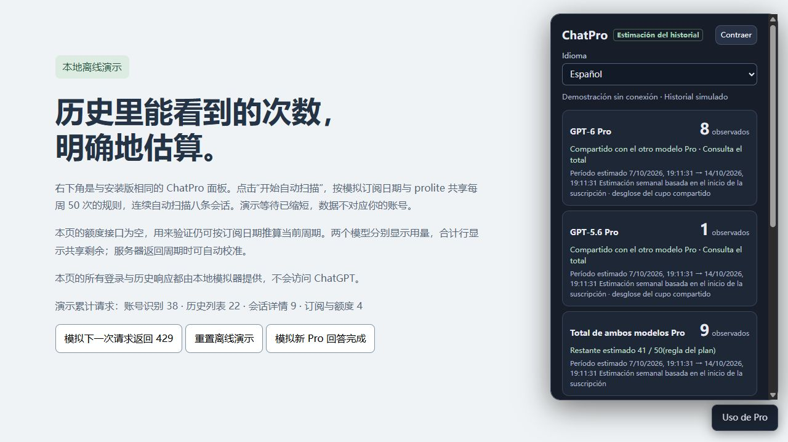

# ChatPro (Beta)

[English](README.md) · [中文](README.zh-CN.md) · [Instalar](https://raw.githubusercontent.com/afate123/chatpro/main/dist/chatpro.user.js) · [Cambios](CHANGELOG.md) · [Privacidad](PRIVACY.md)

Script de Tampermonkey que estima el uso de los modelos Pro a partir del historial de Chat guardado en la nube de ChatGPT. Incluye conversaciones anteriores a la instalación y las guardadas desde otros dispositivos. Conserva revisiones en caché, restaura los conteos al recargar y consulta nuevas respuestas automáticamente.

**Beta no oficial.** Los conteos y los saldos son estimaciones. Las fechas de facturación sirven como referencia cuando falta un reinicio confirmado; no demuestran cuándo se reinicia el cupo real. Los datos explícitos del servidor tienen prioridad. Los puntos de acceso privados y la página pueden cambiar.



## Instalación y actualización

1. Instala [Tampermonkey](https://www.tampermonkey.net/) en tu navegador.
2. Abre [Instalar ChatPro](https://raw.githubusercontent.com/afate123/chatpro/main/dist/chatpro.user.js) y confirma la instalación.
3. Abre chatgpt.com y pulsa **Uso de Pro → Iniciar escaneo automático** una vez. Mantén una sola copia activa.

Instala desde el enlace anterior o copia todo el contenido de dist/chatpro.user.js en el script existente de Tampermonkey.

El panel admite español, inglés y chino. Selecciona el idioma principal del navegador automáticamente; otros idiomas usan inglés. Puedes elegir **Español** en el panel: el cambio es inmediato y se conserva al recargar. Todas las traducciones usan el mismo script y la misma caché; no se consulta ningún servicio de traducción. Las fechas respetan tu zona horaria local.

Al volver, verifica la cuenta y restaura los registros. Tras completar un escaneo, detecta nuevas respuestas y revisa cada 3 minutos mientras la página esté visible. Las consultas están separadas al menos 60 segundos y se aplazan durante la generación reconocida. La sincronización, las respuestas largas y los límites de solicitudes pueden retrasar el conteo. Contraer el panel no detiene las actualizaciones; pausarlas sí, incluso después de recargar.

Tampermonkey comprueba los metadatos de la rama pública main. Actualizar el script existente conserva sus datos. Mantén su nombre base, namespace y claves de almacenamiento; evita copias duplicadas.

## Reglas de estimación

| Plan | Regla local de respaldo |
|---|---|
| Pro $100 | 50 mensajes semanales compartidos entre ambos modelos Pro |
| Pro $200 | 100 o 200 mensajes semanales compartidos, según el derecho anterior y su vencimiento |
| Pro $500 | GPT-6 Pro: 250 mensajes semanales; sin inventar otro límite o un cupo combinado |
| Plan desconocido | Sin límite numérico automático; selecciona una regla compatible o configura un período conocido |

El derecho anterior de Pro $200 requiere una suscripción activa en algún momento entre el 22/09/2026 y el 29/09/2026 a las 10:00, hora del Pacífico. Se conserva hasta el 29/10 mientras la suscripción esté activa; cancelar y volver a suscribirse en la misma cuenta puede conservarlo. Véase [la explicación oficial](https://help.openai.com/en/articles/9793128-about-chatgpt-pro-tiers).

El modo automático reconoce intervalos de suscripción que cubren esas fechas o pruebas previas guardadas para la misma cuenta. Una renovación reciente no demuestra falta de elegibilidad: sin pruebas, el límite queda pendiente antes del vencimiento. Puedes seleccionar manualmente un derecho confirmado. Después del 29/10, la regla anterior pasa automáticamente a 100, incluso si se seleccionó manualmente. El instante exacto no está publicado: la convención local es el 30/10 a las 00:00 del Pacífico, y los nuevos límites explícitos del servidor tienen prioridad.

La página oficial confirma las fechas, pero no indica las cifras 200→100; estas aparecen en [una notificación reproducida por un usuario](https://community.openai.com/t/pro-200-is-fine-please-don-t-improve-it/1402079). Los límites numéricos y el cupo compartido de $200 son reglas de estimación de este proyecto, no una verificación del consumo real de cada cuenta. Consulta [las fuentes y limitaciones](docs/QUOTA_POLICY.md).

Cada modelo muestra su propio uso; el saldo compartido aparece solo en la fila combinada. Se estiman períodos de 7 × 24 horas desde el inicio de suscripción, calibrados con reinicios observados del servidor. También puedes indicar un reinicio real conocido manualmente. No se inventa un período válido si faltan datos necesarios o la suscripción ha vencido.

## Conteo y limitaciones

- Examina chats normales y archivados, y respuestas finales completadas correctamente con etiquetas gpt-6-pro o gpt-5-6-pro.
- Cuenta una pregunta por su última respuesta válida. Las regeneraciones cuentan una vez; las ramas y el consumo real del servidor pueden diferir.
- Excluye Work, Codex y chats temporales reconocidos. No puede reconstruir conversaciones borradas o no disponibles.
- Si falta historial o hay respuestas sin clasificar, el saldo permanece desconocido; un aviso de agotamiento del servidor tiene prioridad.
- Los lotes continúan automáticamente. Un error 429 activa una espera y luego reanuda; otros errores o cambios de cuenta detienen las actualizaciones.
- Las pruebas automáticas y la demostración usan datos sintéticos. Sigue pendiente parte de la validación real con Tampermonkey: [validación](VALIDATION.md), [lista de aceptación](docs/LIVE_VALIDATION.md).

## Privacidad y ayuda

Sin telemetría ni servidor externo de datos. Las solicitudes de uso e historial van a chatgpt.com; las actualizaciones del script consultan direcciones públicas de GitHub. Solo se guarda la información mínima de conteo: hashes de cuenta y mensajes, IDs de conversación, revisiones, modelos, fechas, límites y progreso. No se guardan textos, títulos, correos, cookies ni tokens de acceso. La caché sigue siendo información personal sobre tu uso.

El diagnóstico se descarga localmente, sin enviarlo a nadie. Incluye un prefijo del hash de cuenta y fechas precisas: revísalo y elimina esos datos antes de compartirlo. **Borrar registros locales** elimina la caché de la cuenta actual, pero conserva la configuración y la espera por límites. Eliminar los datos del script desde Tampermonkey borra todo. Consulta [privacidad](PRIVACY.md) y [seguridad](SECURITY.md).

Para errores, usa la plantilla de incidencias e incluye versiones, plan, pasos y diagnóstico anonimizado. Nunca publiques tokens, cookies ni texto de conversaciones. Los campos técnicos y archivos de diagnóstico mantienen sus claves originales para facilitar el soporte.

## Desarrollo y publicación

Node.js 22 o posterior, sin dependencias npm. La preparación de archivos de publicación también necesita tar.

```sh
npm run build
npm test
npm run build:verify
npm run check
npm run release:prepare
```

package.json es la única fuente de versión; release.config.json define repositorio y rama. Se generan script, metadatos, archivo completo de fuentes públicas y sumas SHA256. CI ejecuta las comprobaciones en Windows y Linux. Preparar archivos localmente no publica nada. Consulta [contribuciones](CONTRIBUTING.md) y [publicación](docs/PUBLISHING.md).

AGPL-3.0-only. El código fuente completo está incluido. Véanse [licencia](LICENSE) y [avisos de origen](THIRD_PARTY.md). Sin afiliación con OpenAI ni garantía.
