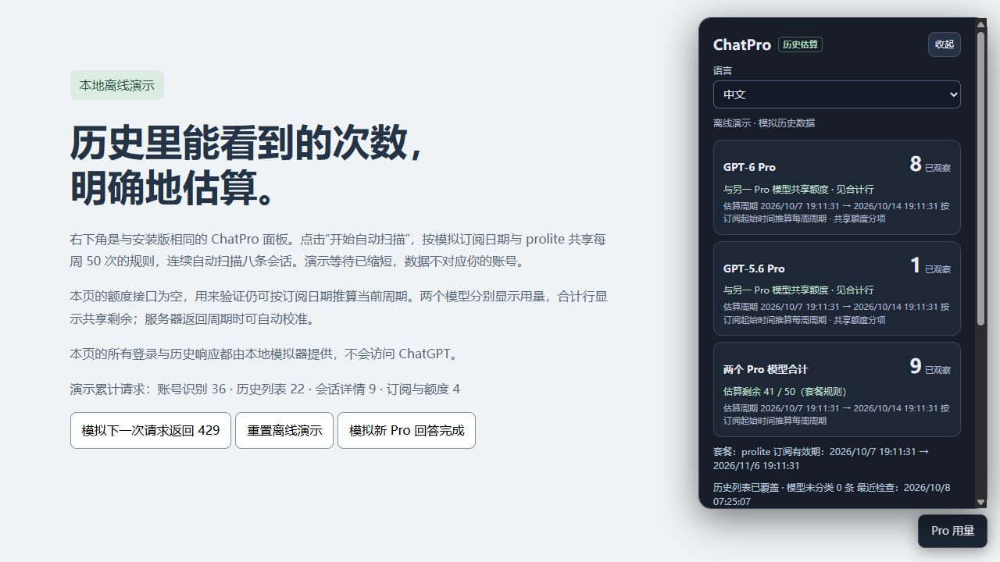

# ChatPro (Beta)

[中文](README.zh-CN.md) · [Español](README.es.md) · [Install](https://raw.githubusercontent.com/afate123/chatpro/main/dist/chatpro.user.js) · [Changes](CHANGELOG.md) · [Privacy](PRIVACY.md)

A Tampermonkey userscript that estimates ChatGPT Pro usage from saved cloud Chat history, including messages sent before installation and on other devices. It caches conversation revisions, restores results after reload, and automatically checks for new answers.

**Unofficial Beta.** Counts and remaining allowances are estimates. Billing dates are used as a fallback period anchor; they are not proof of actual quota resets. Server signals override presets when available. Private endpoints and page layouts can change.



## Install

1. Install [Tampermonkey](https://www.tampermonkey.net/) for your browser.
2. Click **[Install ChatPro](https://raw.githubusercontent.com/afate123/chatpro/main/dist/chatpro.user.js)** and confirm in Tampermonkey.
3. Open chatgpt.com, then Pro usage → Start automatic scan. Keep one script copy enabled.

Install from the link above, or open dist/chatpro.user.js locally and copy its full content into an existing Tampermonkey script.

On later visits, your account is verified automatically and saved statistics restored. After a completed scan, new answer events schedule incremental updates; visible pages also reconcile every 3 minutes. Checks are at least 60 seconds apart and pause during recognized streaming. Server synchronization, long answers, rate limits and hidden tabs may delay updates. The panel can be collapsed while updates continue.

Tampermonkey checks the public main branch's metadata for updates. Updating the existing script preserves its storage. Do not rename its namespace or install duplicate copies.

The panel supports Chinese, English and Spanish. Automatic selection uses the browser's primary language (other languages fall back to English); its language selector applies immediately and persists after reload. All languages use the same script, cache and counters. No translation service is contacted. Dates use the chosen language and your local time zone; raw diagnostic keys remain unchanged.

## Allowance presets

| Profile | Local fallback rule |
|---|---|
| Pro $100 | Two Pro models share 50 messages/week |
| Pro $200 | Two Pro models share 100 or 200 messages/week; dated eligibility and automatic expiry |
| Pro $500 | GPT-6 Pro 250 messages/week; no invented GPT-5.6/shared cap |
| Unknown plan | No automatic numerical fallback; explicitly select a supported preset or set a manual period |

The $200 shared rule is this project's estimate policy. OpenAI's [tier explanation](https://help.openai.com/en/articles/9793128-about-chatgpt-pro-tiers) confirms grandfathering for an active Pro $200 subscription at any point from September 22, 2026 through September 29, 10 a.m. Pacific, lasting through October 29 on an active subscription. Canceling and rejoining the same account preserves eligibility. The public Help Center does not state the 200→100 numbers; affected users have [reposted their notification](https://community.openai.com/t/pro-200-is-fine-please-don-t-improve-it/1402079). These values are local presets, not verified account quotas. See [policy evidence](docs/QUOTA_POLICY.md).

Auto mode uses a matching subscription interval or previously cached qualifying evidence to select 200. A recent renewal alone cannot prove ineligibility, so insufficient evidence leaves the cap unknown; a confirmed qualification can be selected manually. After October 29, even a manually selected old qualification falls back to 100 automatically. The exact expiry instant is unpublished; the local convention is October 30 midnight Pacific. Fresh server caps override this convention.

Preset selection is under 额度与周期设置 → 套餐额度规则; it only changes local estimates. Server caps take precedence. The two individual counters subdivide a shared cap for $100/$200; they do not receive two separate allowances. Billing periods are split into repeating 7 × 24 hour windows. Previously observed server reset boundaries calibrate later estimates. A manual known reset time can be used instead.

## Counting and limitations

- Reads ordinary and archived saved Chat conversations and final successfully completed text/multimodal answers for gpt-6-pro and gpt-5-6-pro.
- Counts one user turn using its latest successful answer; regenerations are counted once. This may differ from server charging or branch semantics.
- Excludes recognized Work/Codex and temporary chats. Deleted or otherwise unavailable histories cannot be reconstructed.
- Incomplete or unclassified history keeps remaining estimates unknown; server-reported exhaustion overrides that.
- First scans run automatically in batches; 429 stops requests and resumes after cooldown. Pause persists across reload. Account changes or ordinary errors stop updates.
- Tested with synthetic responses and automated accounting tests. Live browser/tier coverage remains incomplete: [validation](VALIDATION.md), [live acceptance](docs/LIVE_VALIDATION.md).

## Privacy and help

No telemetry or external data backend. Runtime account/history requests go to chatgpt.com; only minimum accounting metadata is persisted. Update checks use public GitHub URLs. No tokens, emails, titles or chat text are stored or exported. Diagnostic files still contain an account hash prefix and precise dates; review before sharing. See [privacy](PRIVACY.md) and [security reporting](SECURITY.md).

Report functional problems using the bug template. Include versions, selected quota profile, reproduction steps and redacted diagnostics. Never upload access tokens, cookies or chat text.

## Development

Node.js 22+, no npm dependencies:

```sh
npm run build
npm test
npm run build:verify
npm run check
npm run release:prepare
```

The single version source is package.json. Repository/branch settings are in release.config.json. Build generates the install script and lightweight update metadata; source consistency checks run in CI on Windows/Linux. Tag releases prepare a complete public source archive, license, privacy, attribution and SHA256 checksums alongside the userscript. Release preparation also needs `tar` (included in current Windows and GitHub Ubuntu runners). Local preparation does not upload anything.

After building, serve the offline preview with `python -m http.server 8876 --bind 127.0.0.1` and open http://127.0.0.1:8876/preview.html. All ChatGPT responses are synthetic, stored under an isolated demo prefix. See [contributing](CONTRIBUTING.md) and [publishing](docs/PUBLISHING.md).

## License and attribution

AGPL-3.0-only; full corresponding source is included. See [LICENSE](LICENSE) and [source notices](THIRD_PARTY.md). No OpenAI affiliation or warranty.
